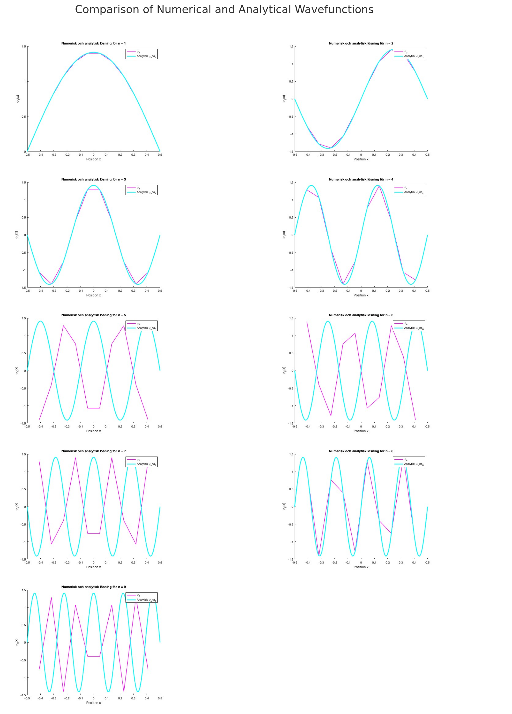
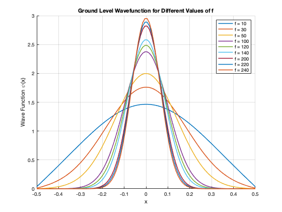

# 📡 Quantum Mechanics: Solving the Schrödinger Equation Numerically

## 🔬 Introduction

Hi and welcome to my repository:), here we explores the quantum mechanics numerically. The problem that is being solved and analysed is the classicle quantum problem "particle in a potential well". What we specifically do is that we solve **time-independent Schrödinger equation** for the particle using matrix methods. This is a fundamental problem in quantum mechanics and therefore important to understand so let's go over it together and break in down. 

We will have to construct and solve tridiagonal matrices as an approximate to the Schrödinger equation and to do this we will uese **Matlab**. The goal is to compare the numerical solution with an analytical solution and explore the behavior of quantom states under different potentials. 

---

## 📜 Problem Formulation

The **time-independent Schrödinger equation** in one dimension is:

$$
-\frac{1}{2} \frac{d^2 \psi}{dx^2} + V(x) \psi(x) = E \psi(x)
$$

where:
- $\( \psi(x) \)$ is the wave function,
- $\( V(x) \)$ is the potential energy,
- $\( E \)$ is the energy eigenvalue.

This equation is fundamental and can be find in any quantum mechanics book so we will ship the long introduction to this, but if it feels foreign look it up before continuing reading. 

### 🔹 Case 1: **Particle in a Box**
A "particle in a box"-problem is something you see very often in the quantum world and when you see one you should feel happy because it is a simplificaton of something really complex into something we can solve. 

The simplest case is when $\( V(x) = 0 \)$ inside a box of width $\( a \)$, and infinite outside. The analytical solutions are:

$$
\psi_n(x) = \sqrt{\frac{2}{a}} \sin\left(\frac{n\pi x}{a}\right), \quad E_n = \frac{n^2 \pi^2}{2 a^2}
$$

where $\( n = 1, 2, 3, ... \)$ indexes the quantum states.
$a$ is usually something small like one nanometer. 

### 🔹 Case 2: **Harmonic-like Potential**
For a quantum dot system it is a bit more complex because we will now deal with a potential that is not zero inside the box. The potential inside the well is modeled as:

$$
V(x) = \frac{(f x)^2}{2}
$$

where $\( f \)$ is a scaling factor. The goal is to find the **numerical eigenvalues and eigenfunctions** and compare them to first-order perturbation theory. 

---

## 🛠️ Numerical Method

We discretize the Schrödinger equation using a **finite difference method**. The Finite difference method is a numerical technique for solving differential equations. Broadly speaking you take a non-linear equation sush as a ODE or PDE and convert it into a system of linear equations. These linear equations can be solved with some matrix algebra. If this is something completely new do a quick google search and learn it a bit more in detail, this will help you understand the code better. 

The equation transforms into a matrix eigenvalue problem:

$$
H \psi = E \psi
$$

where $\( H \)$ is a **tridiagonal Hamiltonian matrix** with:
- **Main diagonal**: $\( \frac{1}{\Delta^2} + V_k \)$
- **Off-diagonal terms**: $\( -\frac{1}{2\Delta^2} \)$

Here, $\( \Delta \)$ is the discretization step size.

### 🔹 Matlab Implementation

Each script in this repository corresponds to a specific problem:

- **`quantumSE1.m`**: Calculates the eigenfunction and eigenvalues and plots the accuracy of the numerical solution. 
- **`quantumSE2.m`**: Computes the wave function for different values of \( f \) and visualizes how it changes.
- **`quantumSE3.m`**: Uses `fminsearch` to find the optimal \( f \) by minimizing the error between numerical and first-order perturbation theory results.
- **`quantumSE4.m`**: Investigates how first-order perturbation theory breaks down for large \( f \).

---

## 📊 Results & Discussion

### 🔹 Accuracy of Numerical Eigenvalues
We compare **numerical and analytical eigenvalues** for a particle in a box. As the number of grid points \( N \) increases, numerical results converge to analytical ones:

| Level \( n \) | Analytical \( E_n \) | Numerical \( E_n \) (N=10) | Numerical \( E_n \) (N=50) |
|--------------|----------------------|----------------------|----------------------|
| 1            | 4.9348                | 4.9014               | 4.9332               |
| 2            | 19.7392               | 19.2083              | 19.7143              |
| 3            | 44.4132               | 41.7619              | 44.2870              |
| ...          | ...                    | ...                  | ...                  |

For **higher energy levels**, numerical errors increase unless \( N \) is sufficiently large.

### 🔹 Effect of Potential Strength \( f \)
We plot the **ground-state wavefunction** for different values of \( f \):

- **For small \( f \)**: The wave function resembles that of a particle in a box.
- **For large \( f \)**: The wave function narrows and the energy increases significantly.

This follows from perturbation theory:

$$
E_1 \approx \frac{\pi^2}{2} + \frac{h^2 f^2 ( \pi - 6 )}{24 m_e \pi^2} \left(\frac{m_e a^2}{h^2} \right)
$$

For large \( f \), perturbation theory **fails** to capture the rapid energy increase.

---

## 📈 Figures

### 🔹 Numerical vs Analytical Wavefunction

### 🔹 Effect of \( f \) on Ground State

---

## 🔮 Conclusion

- **Numerical methods** provide a powerful way to approximate quantum systems, especially when analytical solutions are not feasible.
- **Higher discretization points N ** improve accuracy but increase computational cost.
- **Perturbation theory is only valid for weak potentials**—for strong potentials, numerical solutions deviate significantly.
- **Future work:** Extend the model to **higher dimensions** and test different potentials!

---

## 📂 Repository Structure

